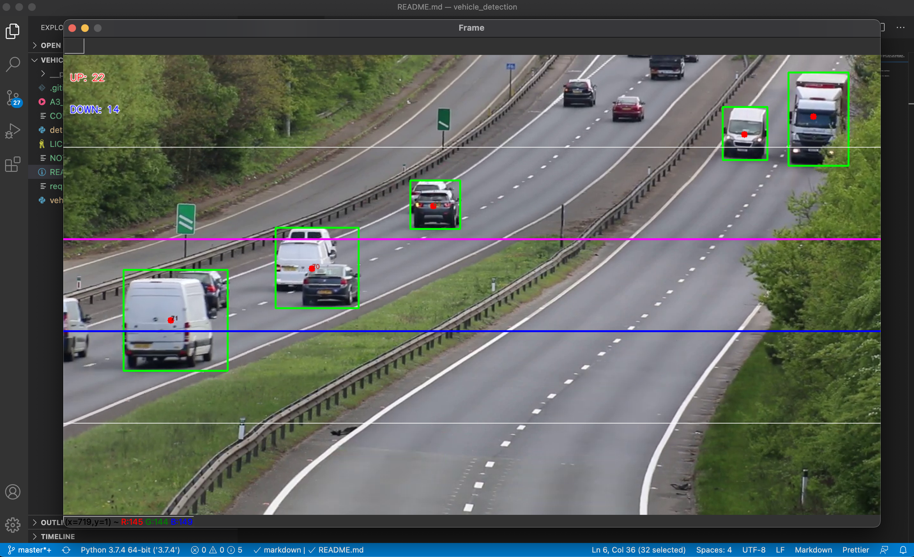

# Vehicle Detection

Computer Vision to detect vehicles using background subtractions methods of OpenCV Library and morphological transformation for accuracy. It works well with static cameras with support for counting vehicles traveling in opposite directions.

## Install Dependencies
```pip3 install -r requirements.txt```

## Run Script
```python3 vehicle_detection.py```



## Authors

- **Finbarrs Oketunji** _aka 0xnu_ - _Main Developer_ - [0xnu](https://github.com/0xnu)

## License

This project is licensed under the [WTFPL License](LICENSE) - see the file for details.

## Copyright

(c) 2020 [Finbarrs Oketunji](https://finbarrs.eu).

